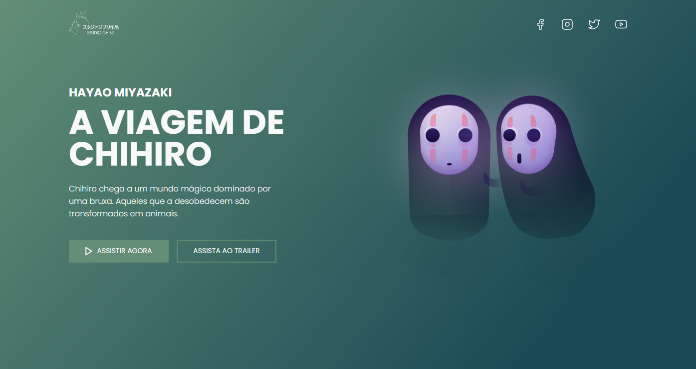

<h1 align="center">
  💻  Studio Ghibli
</h1>

---

<h4 align="center"><a href="https://devjoaogabriel.github.io/studio-ghibli/">Clique para visitar o projeto</a></h4>

---

## 💼 Tecnologias utilizadas

Utilizei apenas essas tecnologias com base em práticar meus conhecimentos:

-  HTML;
-  CSS;

---

> #### Inspirado no Desafio 05 do Programador e UI Designer IURICODE!
>
> - <a href="https://www.figma.com/file/Yb9IBH56g7T1hdIyZ3BMNO/Desafios---Codelândia?node-id=624%3A2">Clique aqui</a> para acessar aos desafios no Figma.
> - <a href="https://github.com/iuricode">Clique aqui</a> para acessar ao perfil do criador dos desafios no GitHub.
>
---